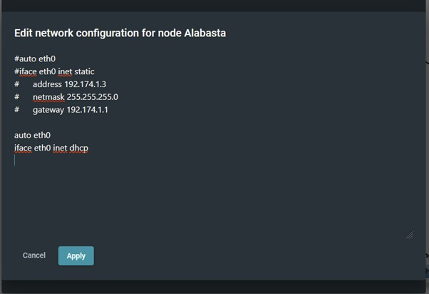
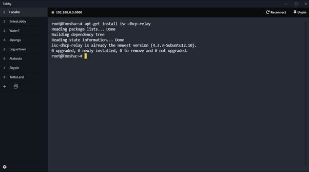
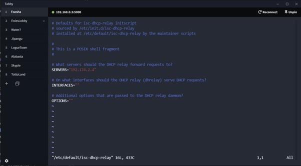

# Jarkom-Modul-2-A11-2021

## Anggota

1. Frederick William Edlim 05111940000016
2. Thomas Dwi Awaka 05111940000021
3. Allam Taju Sarof 05111940000053

## 1. Luffy bersama Zoro berencana membuat peta tersebut dengan kriteria EniesLobby sebagai DNS Server, Jipangu sebagai DHCP Server, Water7 sebagai Proxy Server’

#### a. Ubah network config di foosha menjadi

```
auto eth0
iface eth0 inet dhcp

auto eth1
iface eth1 inet static
    address 192.174.1.1
    netmask 255.255.255.0

auto eth2
iface eth2 inet static
    address 192.174.2.1
    netmask 255.255.255.0

auto eth3
iface eth3 inet static
    address 192.174.3.1
    netmask 255.255.255.0
```


#### b. Lalu setiap node diganti menggunakan dhcp kecuali node di switch 2

auto eth0
iface eth0 inet dhcp



## 2. Foosha sebagai DHCP Relay

#### a. Install isc-dhcp-relay



#### b. Lalu buka file /etc/default/isc-dhcp-relay dan masukan IP jipangu pada field servers


