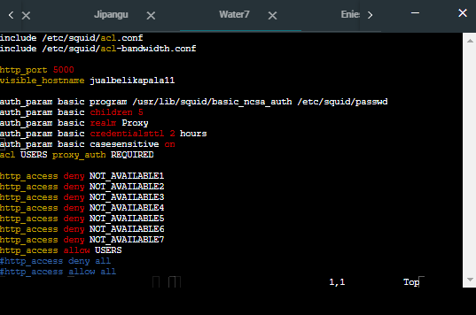
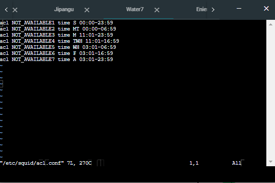
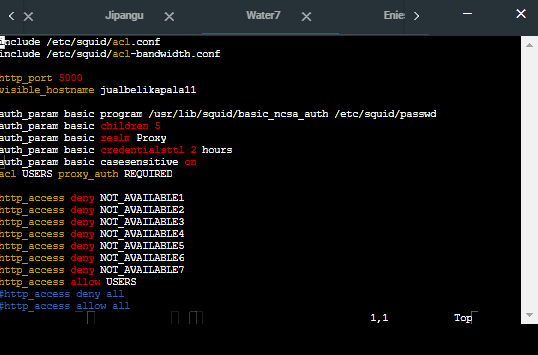
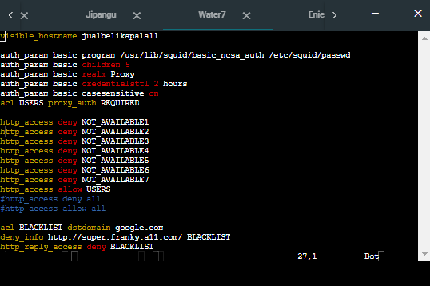
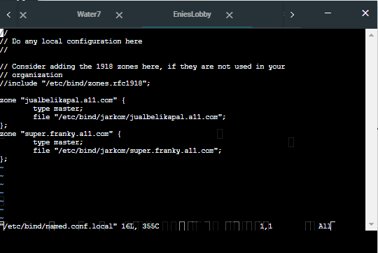
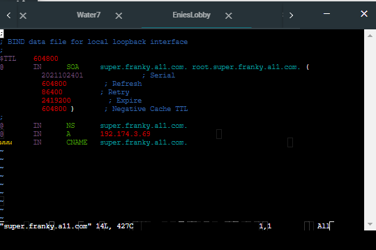
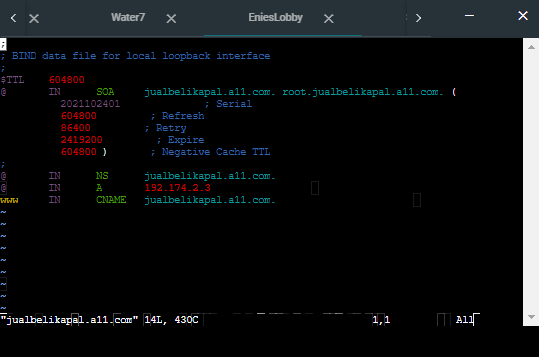
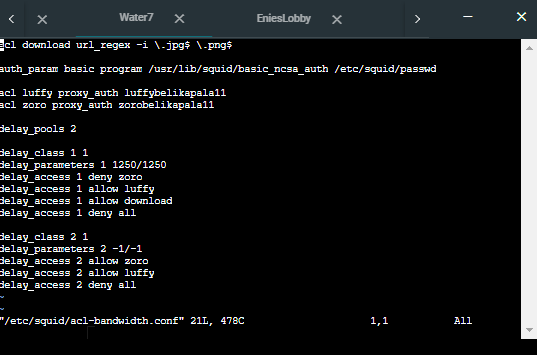
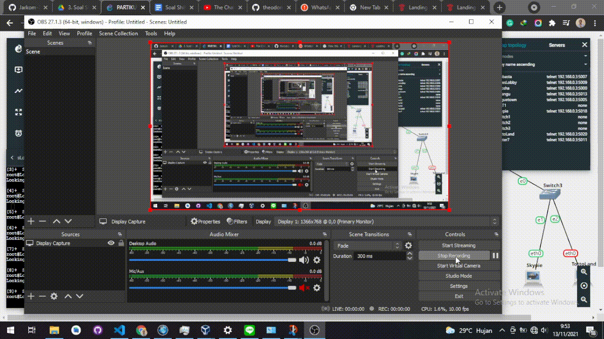
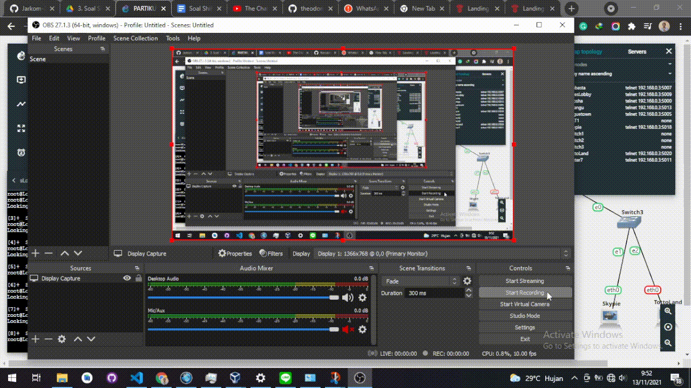

# Jarkom-Modul-2-A11-2021

## Anggota

1. Frederick William Edlim 05111940000016
2. Thomas Dwi Awaka 05111940000021
3. Allam Taju Sarof 05111940000053

## 1. Luffy bersama Zoro berencana membuat peta tersebut dengan kriteria EniesLobby sebagai DNS Server, Jipangu sebagai DHCP Server, Water7 sebagai Proxy Server’

#### a. Ubah network config di foosha menjadi

```
auto eth0
iface eth0 inet dhcp

auto eth1
iface eth1 inet static
    address 192.174.1.1
    netmask 255.255.255.0

auto eth2
iface eth2 inet static
    address 192.174.2.1
    netmask 255.255.255.0

auto eth3
iface eth3 inet static
    address 192.174.3.1
    netmask 255.255.255.0
```


#### b. Lalu setiap node diganti menggunakan dhcp kecuali node di switch 2

auto eth0
iface eth0 inet dhcp


## 2. Foosha sebagai DHCP Relay

#### a. Install isc-dhcp-relay


#### b. Lalu buka file /etc/default/isc-dhcp-relay dan masukan IP jipangu pada field servers


## 3. Client yang melalui Switch1 mendapatkan range IP dari [prefix IP].1.20 - [prefix IP].1.99 dan [prefix IP].1.150 - [prefix IP].1.169

#### a. Pada Jipangu set network config sebagai berikut


#### b. Lalu install isc-dhcp-server pada Jipangu

#### c. Ubah INTERFACE pada file /etc/default/isc-dhpc-server sehingga menjadi seperti ini


#### d. Lalu tambahkan line berikut pada /etc/dhcp/dhcpd.conf


#### e. Lalu restart isc-dhcp-server

#### f. Lalu uji coba dengan merestart Loguetown


Dapat dilihat bahwa loguetown mendapatkan ip 192.174.1.152 dengan lease time 360 detik atau 6 menit

## 4. Client yang melalui Switch3 mendapatkan range IP dari [prefix IP].3.30 - [prefix IP].3.50

#### a. Pada Jipangu, tambahkan line berikut padah dhcpd.conf


#### b. Lalu restart isc-dhcp-server

#### c. Lalu uji coba dengan merestart TottoLand


Terlihat bahwa tottoland mendapatkan ip 192.174.3.34 dengan lease time 720

## 5. Client mendapatkan DNS dari EniesLobby dan client dapat terhubung dengan internet melalui DNS tersebut.

#### a. Lakukan installasi bind9 pada EniesLobby

#### b. Lalu ubah pada file /etc/bind/named.conf.options sehingga menjadi seperti ini


#### c. Lalu test dengan melakukan ping ke google melewati client


## 6. Lama waktu DHCP server meminjamkan alamat IP kepada Client yang melalui Switch1 selama 6 menit sedangkan pada client yang melalui Switch3 selama 12 menit. Dengan waktu maksimal yang dialokasikan untuk peminjaman alamat IP selama 120 menit.

#### a. Sudah di ss sebelumnya terlihat bahwa settingan default-lease-time dan max-lease-time sudah sesuai

## 7. Luffy dan Zoro berencana menjadikan Skypie sebagai server untuk jual beli kapal yang dimilikinya dengan alamat IP yang tetap dengan IP 192.174.3.69

#### a. Pada Jipangu, tambahkan line berikut pada dhcpd.conf


#### b. Lalu ubah file /etc/network/interfaces dari node Skypie menjadi seperti ini


#### c. Lalu restart node skypie


### 8. Loguetown digunakan sebagai client Proxy agar transaksi jual beli dapat terjamin keamanannya, juga untuk mencegah kebocoran data transaksi. Pada Loguetown, proxy harus bisa diakses dengan nama jualbelikapal.A11.com dengan port yang digunakan adalah 5000

#### command agar menggunakan port 5000 di client

```
export http_proxy=http://jualbelikapal.a11.com:5000
```

#### setting di water7 untuk menerima request port 5000

```
echo 'nameserver 192.168.122.1' > /etc/resolv.conf
```

```
echo 'http_port 5000
visible_hostname jualbelikapala11
' > /etc/squid/squid.conf
```



### 9. Agar transaksi jual beli lebih aman dan pengguna website ada dua orang, proxy dipasang autentikasi user proxy dengan enkripsi MD5 dengan dua username, yaitu luffybelikapala11 dengan password luffy_a11 dan zorobelikapala11 dengan password zoro_a11

#### menambahkan auth_param pada water7 /etc/squid/squid.conf

```
echo '
auth_param basic program /usr/lib/squid/basic_ncsa_auth /etc/squid/passwd
auth_param basic children 5
auth_param basic realm Proxy
auth_param basic credentialsttl 2 hours
auth_param basic casesensitive on
acl USERS proxy_auth REQUIRED
http_access allow USERS
' > /etc/squid/squid.conf
```


#### menambahkan akun atau username + pass pada water7
```
htpasswd -c /etc/squid/passwd luffybelikapala11  # type password luffy_a11
htpasswd /etc/squid/passwd zorobelikapala11  # type password zoro_a11
```

hasilnya:

/etc/squid/passwd


### 10. Transaksi jual beli tidak dilakukan setiap hari, oleh karena itu akses internet dibatasi hanya dapat diakses setiap hari Senin-Kamis pukul 07.00-11.00 dan setiap hari Selasa-Jum’at pukul 17.00-03.00 keesokan harinya (sampai Sabtu pukul 03.00)

#### menambahkan time unavailable water7 /etc/squid/acl.conf

```
echo `
acl NOT_AVAILABLE1 time S 00:00-23:59
acl NOT_AVAILABLE2 time MT 00:00-06:59
acl NOT_AVAILABLE3 time M 11:01-23:59
acl NOT_AVAILABLE4 time TWH 11:01-16:59
acl NOT_AVAILABLE5 time WH 03:01-06:59
acl NOT_AVAILABLE6 time F 03:01-16:59
acl NOT_AVAILABLE7 time A 03:01-23:59
` > /etc/squid/acl.conf
```



#### menambahkan acl.conf ke water7 /etc/squid/squid.conf

```
echo `include /etc/squid/acl.conf` > /etc/squid/squid.conf
```

hasilnya:



### 11. Agar transaksi bisa lebih fokus berjalan, maka dilakukan redirect website agar mudah mengingat website transaksi jual beli kapal. Setiap mengakses google.com, akan diredirect menuju super.franky.a11.com dengan website yang sama pada soal shift modul 2. Web server super.franky.a11.com berada pada node Skypie

#### menambahkan deny ke google

```
echo `
acl google dstdomain google.com
http_access deny google
deny_info http://super.franky.a11.com/ google
` > /etc/squid/squid.conf
```

hasilnya:



#### mengatur ulang bind9 di enieslobby /etc/bind/named.conf.local



#### bind9 untuk enieslobby /super.franky.a11.com



#### bind9 untuk enieslobby /jualbelikapal.a11.com




### 12. Saatnya berlayar! Luffy dan Zoro akhirnya memutuskan untuk berlayar untuk mencari harta karun di super.franky.a11.com. Tugas pencarian dibagi menjadi dua misi, Luffy bertugas untuk mendapatkan gambar (.png, .jpg), sedangkan Zoro mendapatkan sisanya. Karena Luffy orangnya sangat teliti untuk mencari harta karun, ketika ia berhasil mendapatkan gambar, ia mendapatkan gambar dan melihatnya dengan kecepatan 10 kbps

#### melimit bandwidth luffy. water7 /etc/squid/acl-bandwidth.conf

```
echo`acl download url_regex -i .jpg$ .png$

auth_param basic program /usr/lib/squid/basic_ncsa_auth /etc/squid/passwd

acl luffy proxy_auth luffybelikapala11
acl zoro proxy_auth zorobelikapala11

delay_pools 2

delay_class 1 1
delay_parameters 1 1250/1250
delay_access 1 deny zoro
delay_access 1 allow luffy
delay_access 1 allow download
delay_access 1 deny all

delay_class 2 1
delay_parameters 2 -1/-1
delay_access 2 allow zoro
delay_access 2 deny luffy
delay_access 2 deny all
`
```





### 13. Sedangkan, Zoro yang sangat bersemangat untuk mencari harta karun, sehingga kecepatan kapal Zoro tidak dibatasi ketika sudah mendapatkan harta yang diinginkannya

#### setting bandwidth ada di nomor 12


