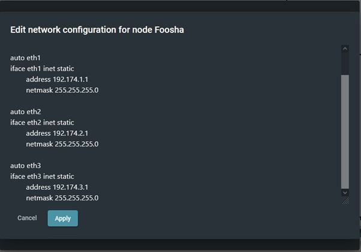

# Jarkom-Modul-2-A11-2021

## Anggota

1. Frederick William Edlim 05111940000016
2. Thomas Dwi Awaka 05111940000021
3. Allam Taju Sarof 05111940000053

## 1. Luffy bersama Zoro berencana membuat peta tersebut dengan kriteria EniesLobby sebagai DNS Server, Jipangu sebagai DHCP Server, Water7 sebagai Proxy Server’

#### a. Ubah network config di foosha menjadi

```
auto eth0
iface eth0 inet dhcp

auto eth1
iface eth1 inet static
    address 192.174.1.1
    netmask 255.255.255.0

auto eth2
iface eth2 inet static
    address 192.174.2.1
    netmask 255.255.255.0

auto eth3
iface eth3 inet static
    address 192.174.3.1
    netmask 255.255.255.0
```



#### b. Lalu setiap node diganti menggunakan dhcp kecuali node di switch 2

auto eth0
iface eth0 inet dhcp


## 2. Foosha sebagai DHCP Relay

#### a. Install isc-dhcp-relay


#### b. Lalu buka file /etc/default/isc-dhcp-relay dan masukan IP jipangu pada field servers


## 3. Client yang melalui Switch1 mendapatkan range IP dari [prefix IP].1.20 - [prefix IP].1.99 dan [prefix IP].1.150 - [prefix IP].1.169

#### a. Pada Jipangu set network config sebagai berikut


#### b. Lalu install isc-dhcp-server pada Jipangu

#### c. Ubah INTERFACE pada file /etc/default/isc-dhpc-server sehingga menjadi seperti ini


#### d. Lalu tambahkan line berikut pada /etc/dhcp/dhcpd.conf


#### e. Lalu restart isc-dhcp-server

#### f. Lalu uji coba dengan merestart Loguetown


Dapat dilihat bahwa loguetown mendapatkan ip 192.174.1.152 dengan lease time 360 detik atau 6 menit

## 4. Client yang melalui Switch3 mendapatkan range IP dari [prefix IP].3.30 - [prefix IP].3.50

#### a. Pada Jipangu, tambahkan line berikut padah dhcpd.conf


#### b. Lalu restart isc-dhcp-server

#### c. Lalu uji coba dengan merestart TottoLand


Terlihat bahwa tottoland mendapatkan ip 192.174.3.34 dengan lease time 720

## 5. Client mendapatkan DNS dari EniesLobby dan client dapat terhubung dengan internet melalui DNS tersebut.

#### a. Lakukan installasi bind9 pada EniesLobby

#### b. Lalu ubah pada file /etc/bind/named.conf.options sehingga menjadi seperti ini


#### c. Lalu test dengan melakukan ping ke google melewati client


## 6. Lama waktu DHCP server meminjamkan alamat IP kepada Client yang melalui Switch1 selama 6 menit sedangkan pada client yang melalui Switch3 selama 12 menit. Dengan waktu maksimal yang dialokasikan untuk peminjaman alamat IP selama 120 menit.

#### a. Sudah di ss sebelumnya terlihat bahwa settingan default-lease-time dan max-lease-time sudah sesuai

## 7. Luffy dan Zoro berencana menjadikan Skypie sebagai server untuk jual beli kapal yang dimilikinya dengan alamat IP yang tetap dengan IP 192.174.3.69

#### a. Pada Jipangu, tambahkan line berikut pada dhcpd.conf


#### b. Lalu ubah file /etc/network/interfaces dari node Skypie menjadi seperti ini


#### c. Lalu restart node skypie


